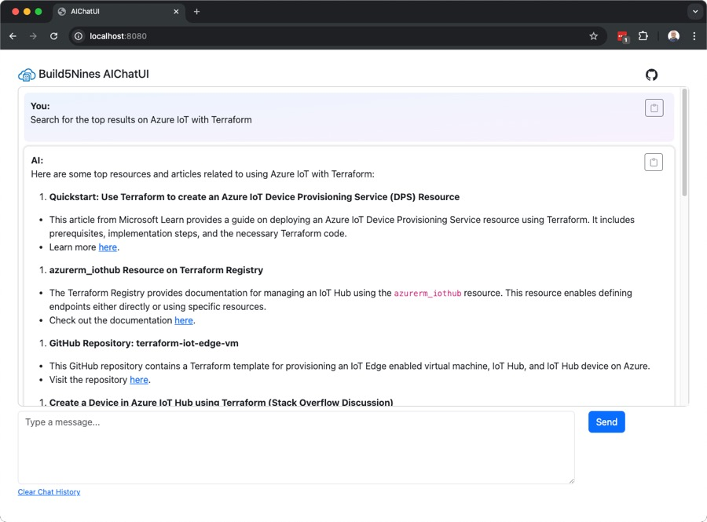
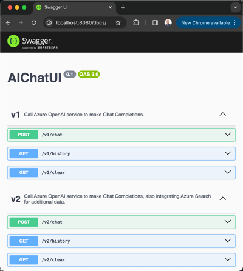

# AIChatUI - Azure OpenAI Chat UI Sample

AIChatUI is a simple chat UI with backend API for making chat completion called against Azure OpenAI Service. The API is written in Javascript using Node.js with Swagger UI support, and a static `Index.html` client for the front-end Chat UI.

> **Like this sample app?** - You can read more about AI / ML, as well as related Microsoft Azure and DevOps topics over at [https://build5nines.com](https://build5nines.com)

## User Interface

The frontend application is written as a static HTML page ([`/static/index.html`](static/index.html)) using Bootstrap and jQuery. Just a simple UI for now.

## API Functionality

The API versions are as follows:

- v1 - Makes chat completions against Azure OpenAI Service.
- v2 - Makes chat completions against Azure OpenAI Service with the integration of Azure Search Service too.

The app integrates Swagger to provide a documentation UI that can be used to see the API endpoints supported, as well as the ability to test them. The Swagger UI is located at `http://localhost:8080/docs` when running the application.

## App Configuration

This application uses the `.env` file to configure the necessary environment variables. A list of what environment variables are necessary is included within the `.env.EXAMPLE` file.

## Required Azure Infrastructure

This application assumes you have an instance of Azure OpenAI Service and Azure Search Service deployed to Microsoft Azure already.

The project includes the following Infrastructure as Code (IaC) templates that can be used to deploy the Azure resources necessary depending on which API version of this app you want to use:

- HashiCorp Terraform
  - [`/IaC/Terraform/v1`](IaC/Terraform/v1) - Deploys Azure OpenAI Service
  - [`/IaC/Terraform/v2`](IaC/Terraform/v2) - Deploys Azure OpenAI Service, Azure Search Service, and Azure Storage Account
- Azure Bicep
  - [`/IaC/Bicep/v1`](IaC/Bicep/v1) - Deploys Azure OpenAI Service
  - [`/IaC/Bicep/v2`](IaC/Bicep/v2) - Deploys Azure OpenAI Service, Azure Search Service, and Azure Storage Account
- Azure ARM Template
  - [`/IaC/ARM/v1`](IaC/ARM/v1) - Deploys Azure OpenAI Service
  - [`/IaC/ARM/v2`](IaC/ARM/v2) - Deploys Azure OpenAI Service, Azure Search Service, and Azure Storage Account

This project was created by [Chris Pietschmann](https://www.pietschsoft.com) _(Microsoft MVP, HashiCorp Ambassador)_.
